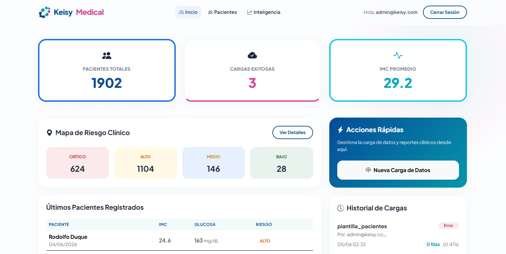
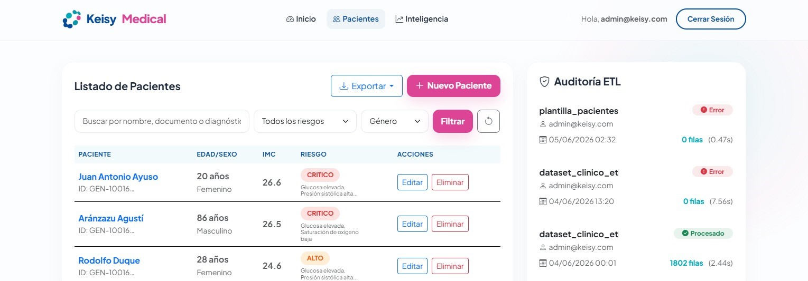
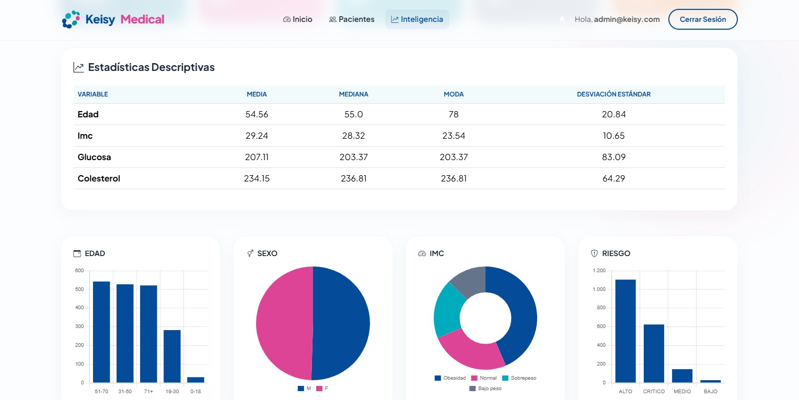

<div align="center">

# KEISY

<p align="center">
  <strong>platform for ETL automation and advanced analytics for clinical data management</strong>
</p>

<p align="center">
  <a href="https://keisy.onrender.com/">Quickstart</a> ·
  <a href="https://keisy.onrender.com/analytics/">Dashboard</a>
</p>


</div>

KEISY is a web system that enables the centralization of data from multiple medical sources, the correction of inconsistencies, the standardization of clinical records, the generation of health indicators, and the execution of predictive models that support medical and administrative decision-making.

The solution is aimed at healthcare providers, clinics, hospitals, and organizations that need to transform large volumes of clinical data into strategic information for healthcare risk management.

<div align="center">

| | |
|---|---|
| - Centralize information from multiple sources. | - Automate ETL (extract, transform, load) processes. |
| - Improve the quality of clinical data. | - Detect inconsistent and duplicate records. |
| - Generate interactive dashboards. | - Implement predictive machine learning models. |

</div>



---

## Objective

KEISY's primary objective is to integrate, clean, transform, analyze, and visualize clinical data in order to identify medical risk factors and generate predictions that support clinical and administrative decision-making.

---


## ETL Module

<table>
<tr>
<td width="33%" valign="top">

<h3>⛏️ Extract</h3>

Allows you to import data in various formats:
CSV, Excel (XLSX), JSON

Features:
* Manual import.
* Bulk upload.
* Source tracking.
* Process traceability.

</td>
<td width="33%" valign="top">

<h3>🛠️ Transform</h3>

Performs data cleansing and standardization.

Functions:
* Data Quality.
* Anomaly detection.
* Normalization
* Spelling correction of diagnoses.
* Standardization of clinical variables.

</td>
<td width="33%" valign="top">

<h3>🔄 Load</h3>

Loads the processed data into the institutional database.

Features:
* Insertion of cleaned records.
* Load versioning.
* ETL history.
* Process auditing.

</td>
</tr>
</table>

---

## Patient Management
The system allows for the management of structured clinical information.

<table>
<tr>
<td width="50%" valign="top">

<h3>🔑 Key Variables</h3>

patient identification, demographic data, vital signs, risk factors, medical history, diagnoses, clinical history.

</td>
<td width="50%" valign="top">

<h3>⚙️ Functions</h3>

registration, updating, viewing, logical deletion, advanced search.

</td>
</tr>
</table>

<div align="center">



</div>

---

## Data Analytics Module
Turns clinical data into strategic insights.

<table>
<tr>
<td width="33%" valign="top">

<h3>Descriptive Statistics</h3>

Automatic calculation of:
* Mean.
* Median.
* Mode.
* Standard deviation.
* Distributions.

</td>
<td width="33%" valign="top">

<h3>Clinical KPIs</h3>

Institutional indicators:
* Critically ill patients.
* Hypertensive patients.
* Diabetic patients.
* Smoking patients.
* Average population risk.
* Distribution by age group.

</td>
<td width="33%" valign="top">

<h3>Segmentation</h3>

Classification of patients by:
* Age.
* Gender.
* BMI.
* Diagnosis.
* Clinical risk.

</td>
</tr>
</table>

---

## Risk Detection Module
Implements clinical rules to identify patients with a higher probability of experiencing adverse events.

Classifications:

> ⬇️ Low Risk: Patients with parameters within normal ranges.

> 😐 Moderate Risk: Patients with moderate risk factors.

> ⚠️ High Risk: Patients with multiple risk factors.

> 🚨 Critical Risk: Patients with potentially life-threatening conditions.

---

## Machine Learning Module
Enables the generation of predictive models for the analyzed population.

### Objective

To estimate the probability of developing diseases or experiencing high-risk clinical events.

**Implemented Models**
* Logistic Regression.
* Decision Tree.
* Random Forest.

**Predictor Variables**
* Age.
* BMI.
* Glucose.
* Cholesterol.
* Blood pressure.
* Heart Rate.
* Family History.
* Smoking.
* Alcohol Consumption.

**Workflow**
```bash
Cleaned Data → Preprocessing → Training → Evaluation → Prediction → Dashboard
```

**Metrics**
* Accuracy.
* Precision.
* Recall.
* F1 Score.
* Confusion Matrix.

---

## Smart Dashboard
Allows you to view clinical information through interactive components.

<table>
<tr>
<td width="50%" valign="top">

<h3>Visualizations</h3>

bar charts, line charts, pie charts, heatmaps, time series trends, KPIs.

</td>
<td width="50%" valign="top">

<h3>Information Displayed</h3>

overall status of the population, risk distribution, progress of critically ill patients, predictive results, data quality.

</td>
</tr>
</table>

<div align="center">



</div>

---

## Alert System
Generates automatic alerts for high-risk patients.

| Type | Features |
| :--- | --- |
| critical alerts, preventive alerts, operational alerts | prioritization by severity, clinical follow-up, administrative notifications |

---

## Tools Used

       

---

## System Architecture
```bash
keisy → Frontend → ETL → Database → ML → Dashboard
```

---

## Quick install
```bash
git clone https://github.com/emilymontec/keisy.git; cd keisy
```
<sub> clone the repository </sub>

### Install dependencies
```bash
pip install -r requirements.txt
```
### Environment variables
```bash
DEBUG=True
SUPABASE_DB_URL=SUPABASE_DB_URL
SUPABASE_DB_PASSWORD=SUPABASE_DB_PASSWORD
```
<sub> create the `.env` file and set the environment variables </sub>

### Database Setup
```bash
python manage.py makemigrations
python manage.py migrate
```
Make the database migrations and create the superuser.
```bash
Create superuser:
python manage.py createsuperuser
```

### Run the application
```bash
python manage.py runserver
```
<sub> Application available at: http://127.0.0.1:8000 </sub>

---

## File Structure
```bash
keisy/
│
├── keisy/
│   ├── settings.py
│   ├── urls.py
│   ├── wsgi.py
│   └── asgi.py
│
├── analytics/
├── authentication/
├── dashboard/
├── datasets/
├── etl/
├── ml/
├── patients/
├── reports/
│
├── static/
├── templates/
│   ├── admin/
│   ├── analytics/
│   ├── authentication/
│   ├── dashboard/
│   ├── etl/
│   ├── ml/
│   ├── patients/
│   └── base.html
│
├── manage.py
├── requirements.txt
├── .env
└── README.md
```

---

## Supported File Formats
| | |
| :--- | --- |
| **Import** | CSV, XLSX, JSON, ZIP (containing CSV/XLSX) |
| **Export** | CSV, XLSX, PDF, JSON, ZIP |

---

## Contributing
### Fork repository

**Create branch**
```bash
git checkout -b feature/my-feature
```

**Commit changes**
```bash
git commit -m "Add new feature"
```

**Push changes**
```bash
git push origin feature/my-feature
```
Open a Pull Request describing the proposed changes.

---

## Author
**Emily Monterrosa Castro - Full Stack Developer** <br>
[GitHub](https://github.com/emilymontec) · [LinkedIn](https://www.linkedin.com/in/emilymontec/) · [Portfolio](https://emilymontec.github.io/portfolio/)

---

## License

MIT License.

See the [LICENSE](LICENSE) file for additional information.

---

## Appendices
See the [UserGuide](docs/MANUAL%20USUARIO%20KEISY%20MEDICAL.pdf) to learn more.

---

<p align="center">
  <strong>The system is not deployed.</strong>
</p>